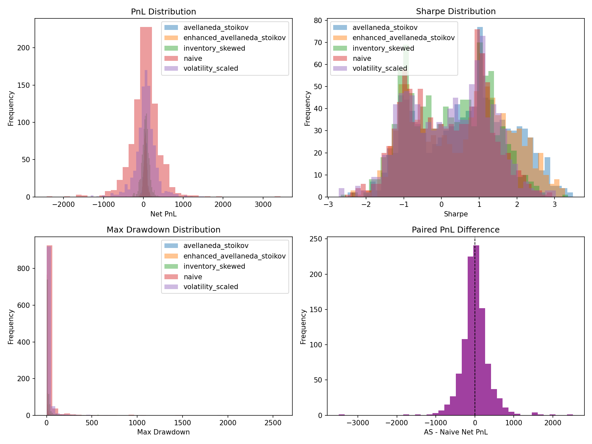
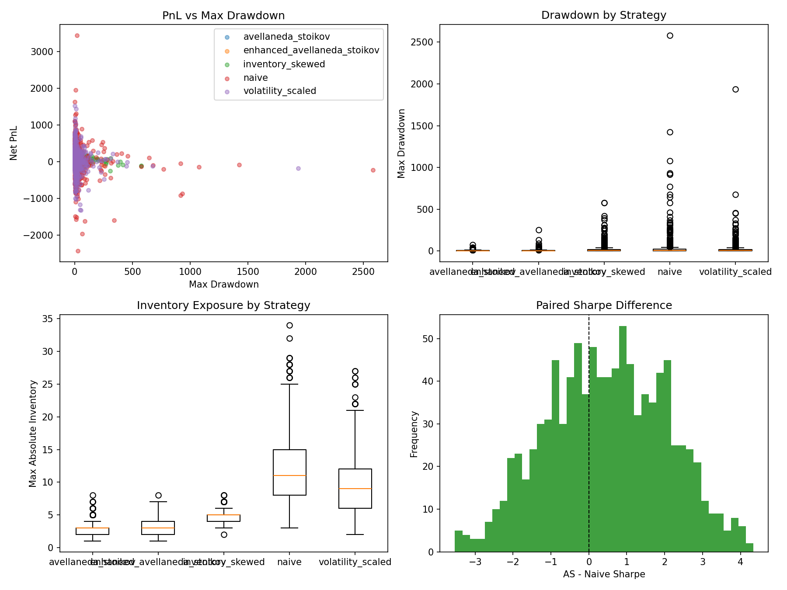

# Digital Market Maker

A Python market-making simulation comparing Avellaneda-Stoikov stochastic control against fixed-spread and risk-aware baselines under GBM price dynamics and Poisson order flow.

## Overview

The project models a liquidity provider quoting bid and ask prices around a stochastic mid-price. It compares strategies on PnL, Sharpe ratio, Sortino ratio, drawdown, inventory exposure, and fee impact.

The final result is that calibrated Avellaneda-Stoikov quoting improves risk-adjusted performance versus a naive fixed-spread market maker. The improvement comes mainly from lower variance and drawdown, not from statistically significant higher raw PnL.

## Strategies

- `naive`: fixed spread around the mid-price.
- `avellaneda_stoikov`: reservation-price and optimal-spread quoting from the AS approximation.
- `inventory_skewed`: fixed spread with inventory-dependent quote skew.
- `volatility_scaled`: fixed spread widened by realised short-window volatility.
- `enhanced_avellaneda_stoikov`: AS quoting using realised volatility as an input.

The best tested strategy was standard Avellaneda-Stoikov with `gamma=5`.

## Model

Mid-price follows a geometric Brownian motion process. Order arrivals are modelled with exponential Poisson intensities:

```text
lambda(delta) = A * exp(-k * delta)
```

The Avellaneda-Stoikov reservation price is:

```text
r = s - q * gamma * sigma^2 * (T - t)
```

The total optimal spread approximation is:

```text
gamma * sigma^2 * (T - t) + (2 / gamma) * log(1 + gamma / k)
```

The simulator also includes maker rebates, taker fees, deterministic seeding, SQLite persistence, Monte Carlo batch runs, parameter sweeps, and saved report plots.

## Final Results

Monte Carlo batch testing used paired seeds across strategies. The final comparison used 1,000 paired runs and AS `gamma=5`.

| Strategy | Mean PnL | PnL Std | Mean Sharpe | Mean Max Drawdown |
| --- | ---: | ---: | ---: | ---: |
| Avellaneda-Stoikov | 48.15 | 43.44 | 0.642 | 4.29 |
| Enhanced AS | 48.24 | 45.91 | 0.573 | 5.52 |
| Inventory-skewed | 51.56 | 93.65 | 0.213 | 18.48 |
| Naive | 44.66 | 368.25 | 0.167 | 31.45 |
| Volatility-scaled | 56.47 | 264.41 | 0.230 | 20.36 |

Paired AS-vs-naive result:

```text
PnL AS - naive: mean diff = 3.49, p = 0.761
Sharpe AS - naive: mean diff = 0.475, p < 0.001
```

Interpretation:

- AS materially improves Sharpe versus naive.
- The PnL improvement is not statistically significant.
- AS dominates mainly through lower variance, lower drawdown, and better inventory control.
- The tested model improvements did not beat standard AS on risk-adjusted performance.

## Report Figures

### Batch Distributions



### Strategy Diagnostics



## Usage

Install dependencies:

```bash
python -m venv venv
source venv/bin/activate
pip install -r requirements.txt
```

Run a single simulation:

```bash
python main.py
```

Run a paired Monte Carlo batch:

```bash
python -m src.run_batch --n-runs 1000 --strategy both --gamma 5
```

Generate the report summary and plots:

```bash
python main.py --batch --plot
```

Run a gamma sweep:

```bash
python -m src.sweep --n-runs 1000 --gamma-values 2,3,4,5,6,7,8
python main.py --sweep
```

Run additional baselines:

```bash
python -m src.run_batch --n-runs 1000 --strategy inventory_skewed --inventory-skew 0.05
python -m src.run_batch --n-runs 1000 --strategy volatility_scaled --volatility-spread-multiplier 0.5
python -m src.run_batch --n-runs 1000 --strategy enhanced_avellaneda_stoikov --gamma 5
```

## Docker

Build and run the report container:

```bash
docker compose up app
```

Generate fresh batch data:

```bash
docker compose run batch
```

The SQLite database is stored as `results.db`, and report images are written to `reports/`.

## Project Structure

```text
src/
  analysis.py
  analysis_report.py
  config.py
  environment.py
  market_maker.py
  run_batch.py
  simulation.py
  sweep.py
  storage/
    db.py
    models.py
    queries.py
main.py
Dockerfile
docker-compose.yml
```

## Conclusion

The calibrated Avellaneda-Stoikov strategy is the strongest final model in this project. It does not reliably increase average PnL versus naive quoting, but it produces a statistically significant improvement in Sharpe ratio and substantially reduces drawdown and PnL variance.
